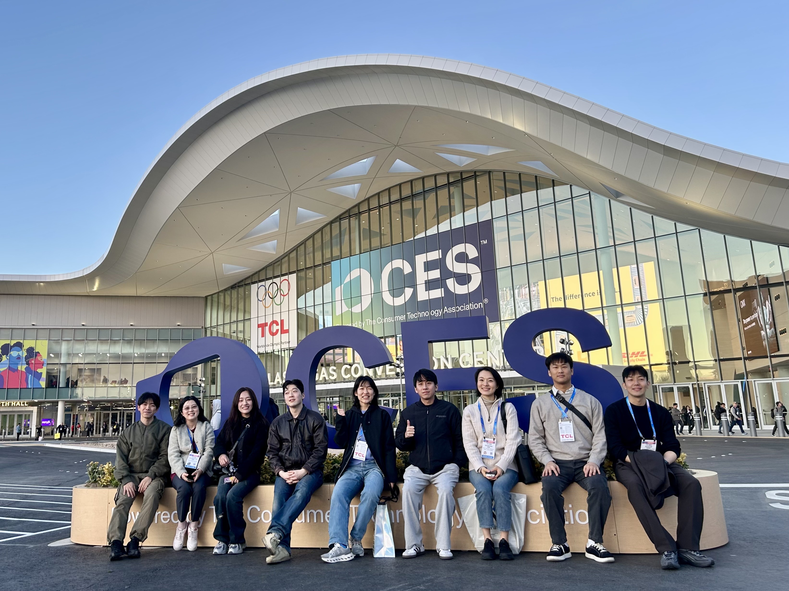
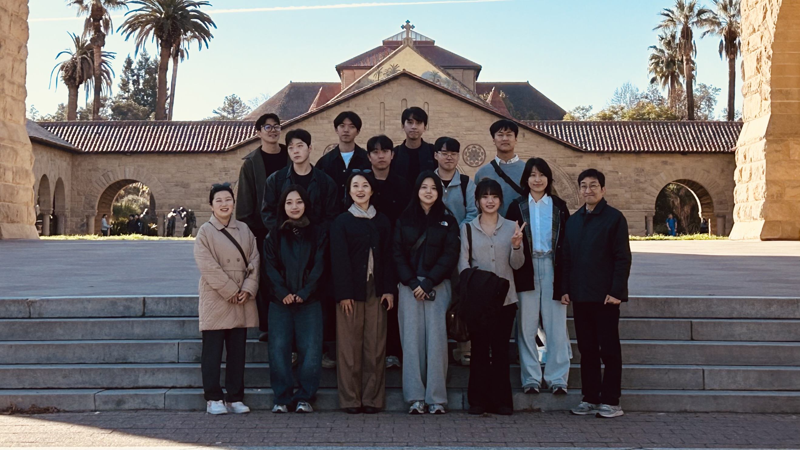
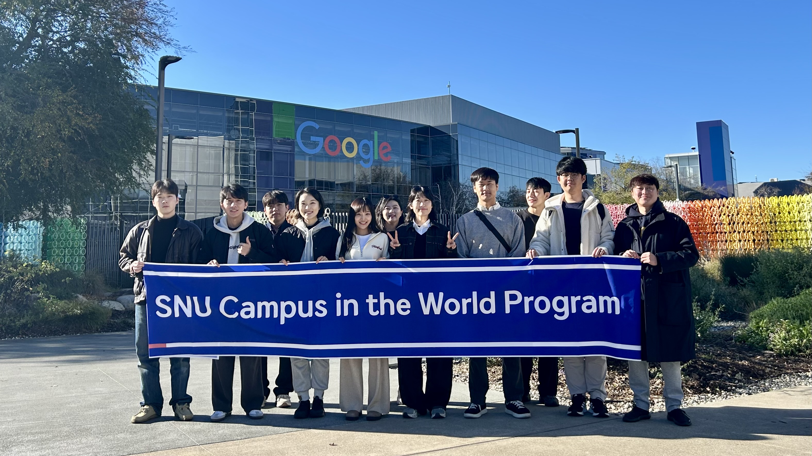

# 글로벌 스타트업 스튜디오
Global Startup Studio

M2177.011400
> This course is linked to the SNU Campus in the World program and selects one of the world’s major innovation hubs. Students form multidisciplinary teams to carry out practical startup projects and receive mentoring and feedback from local alumni, entrepreneurs, and experts. Through these activities, students cultivate problem-solving skills and entrepreneurial mindsets suited to global market environments, while building international business networks through direct engagement with local startup ecosystems. By testing and refining their ideas in diverse cultural and market contexts, students are expected to develop a balanced set of technical competencies, leadership skills, and global perspectives.

<!-- - __Location__: Bld 38-429 -->
<!-- - __Lecture__: Wednesday 14:00 – 16:50 -->
  
## Instructor


{{ staffer }}


## Teaching Assistant




{{ staffer }}



---

## Note
This course is avilable only for student who participated SNU Campus in the World Program.

<!-- 
## Grading
- Attendance: 5%
- Assignment: 40%
- Final Exam: 25%
- Attitude: 5%
- Project: 25%
-->

<!-- 
## Assignment
- Defective PCB Detection
  - [Reference Paper](https://www.nature.com/articles/s41597-024-03656-8)    
  - [Dataset](https://figshare.com/articles/dataset/DsPCBSD_/24970329?file=44069552)
- Classification of Vibration Signal
  - [Reference Paper](https://ieeexplore.ieee.org/document/9078761)
  - [Dataset](https://engineering.case.edu/bearingdatacenter/download-data-file)
- LLM with Digital Twin
  - [Reference Paper](https://ieeexplore.ieee.org/document/10710900)
-->

<!--
| Phase | Week | Date | Topic | Lab session / Activity |
|:----|:----:|:----:|----|------|
| **Phase I – Manufacturing from Living Systems** | 1 | 3/4 | Course Introduction: Why **Physical AI** for Manufacturing - Overview of course structure and projects | - |
|  | 2 | 3/11 | Manufacturing in Living Systems I: Cell-Level Production - How single cells manufacture structure and function. DNA as constraint rather than blueprint. Distributed manufacturing without centralized control | Individual expertise and interests introduction |
-->

## 2026 SNU Campus in the World Program

**Objectives**
- To identify students with strong aspirations for global entrepreneurship within the university and support their growth toward successful AI-based global startups.
- To provide opportunities for global mentoring and advanced business planning based on each participant’s startup idea, thereby promoting entrepreneurial success.

**Expected Outcomes**  
- Through the program, participants are expected to establish startup companies and achieve tangible progress toward entry into global markets.

**Eligibility**  
- 15 enrolled students of Seoul National University

**Visited Regions**  
- Las Vegas, San Francisco, Palo Alto, USA

**Program Period**  
- January 6–14, 2026  
  (Return to Korea: January 16, 2026)

**Detailed Schedule**

| Date | Activity |
|:----:|----|
| 1/6 | Travel from Incheon International Airport to Las Vegas |
| 1/7 | Attendance at CES 2026 |
| 1/8 | Attendance at CES 2026 |
| 1/9 | Travel from Las Vegas to San Francisco |
| 1/10 | Participation in the UKF 82 Startup Summit |
| 1/11 | Visit to Stanford University and Startup Ecosystem Engagements, including Global Mentoring |
| 1/12 | Startup Ecosystem Engagements and Global Mentoring |
| 1/13 | Startup Ecosystem Engagements and Global Mentoring |
| 1/14 | Silicon Valley Tour (Google Visitor Center, Intuit, Intel, Berkeley SkyDeck) |
| 1/15 | Return from San Francisco to Incheon International Airport |
| 1/16 | Arrival at Incheon International Airport |

**Photos**

<!--
| Phase | Week | Date | Topic | Lab session / Activity |
|:----|:----:|:----:|----|------|
| **Phase I – Manufacturing from Living Systems** | 1 | 3/4 | Course Introduction: Why **Physical AI** for Manufacturing - Overview of course structure and projects | - |
|  | 2 | 3/11 | Manufacturing in Living Systems I: Cell-Level Production - How single cells manufacture structure and function. DNA as constraint rather than blueprint. Distributed manufacturing without centralized control | Individual expertise and interests introduction |
|  | 3 | 3/18 | Manufacturing in Living Systems II: Mechanism, and Evolution - Historical discovery of biological mechanisms. Viruses as high-speed manufacturing systems. Lessons from the COVID-19 pandemic: mutation, adaptation, and failure | Team building |
|  | 4 | 3/25 | Neurons, Plasticity, and the Emergence of Intelligence - Neurons as structural units of intelligence. Plasticity as structural manufacturing. Learning as a physical process | - |
| **Phase II – Biological Principles of Intelligence** | 5 | 4/1 | Visual Intelligence: Seeing as Physical Interaction - Biological vision as an active, embodied process. From light to cells | Visual perception |
|  | 6 | 4/8 | Language Intelligence: Constraints, Not Commands - Language as a constraint system for coordination, explanation, and responsibility. Implications for human–AI collaboration | Language-guided decision structures using AI model |
|  | 7 | 4/15 | Generative Intelligence: Creating by Shaping Possibility - Generation as exploration of possibility spaces. Biological development, variation, and adaptation. Generative models as explorers rather than producers | Generative exploration and evaluation of solution spaces |
|  | 8 | 4/22 | Explainable AI: Judgment, Responsibility, and Trust - Design requirement for responsibility | Explainable AI |
|  | 9 | 4/29 | **Midterm Exam** | - |
| **Phase III – Domain-specific Physical AI Projects** | 10 | 5/6 | Agents as Decision-Making Entities - Introduction to Agents and Physical AI | Company or Individual Domain Presentations |
|  | 11 | 5/13 | Reinforcement Learning as a Model of Experience - Reframing manufacturing processes in terms of Reinforcement Learning from a Physical AI perspective | RL + Isaac Sim #1 |
|  | 12 | 5/20 | Digital Twin and Simulation for Physical AI - Reward shaping - Role of digital twins and simulators in Physical AI. Simulation as a testbed for policies and potentials. Design of Potentials | RL + Isaac Sim #2 |
|  | 13 | 5/27 | Multi-Agent Systems and Human–AI Collaboration - Limits of full automation. Designing human intervention, responsibility, and safety | - |
|  | 14 | 6/3 | Peer Review | - |
|  | 15 | 6/10 | Final Presentation | - |
-->

<!-- 
## References
- Mingu Jeon, In-Ho Choi, Seung-Woo Seo, and Seong-Woo Kim, "Extremely Rare Anomaly Detection Pipeline in Semiconductor Bonding Process with Digital Twin-driven Data Augmentation Method," IEEE Transactions on Components, Packaging and Manufacturing Technology, Vol. 14, No. 10, pp. 1891 - 1902, Oct. 2024
- Gyuho Lee, Seong-Woo Kim, and Mingu Jeon, “Machinery Value Estimation Method based on IIoT System Utilizing 1D-CNN Model for Low Sampling Rate Vibration Signals from MEMS,” IEEE Internet of Things Journal, Vol. 10, No. 14, pp. 12261-12275, July. 2023
- Mingu Jeon, Siyun Yoo, and Seong-Woo Kim, "A Contactless PCBA Defect Detection Method: Convolutional Neural Networks with Thermographic Images," IEEE Transactions on Components, Packaging and Manufacturing Technology, Vol. 12, No. 3, pp 489 - 501, March 2022
-->
